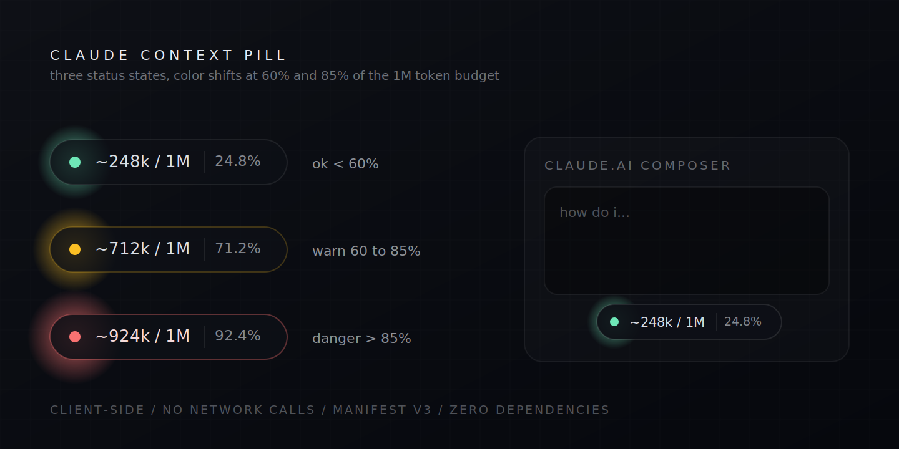

<div align="center">



# claude context pill

a tiny chrome extension that pins an estimated token-usage counter to the claude.ai composer.

[](LICENSE)
[](CHANGELOG.md)
[](manifest.json)
[](#how-the-estimate-works)

</div>

---

claude.ai does not expose a context-usage counter. this extension scrapes the
visible conversation from the DOM, estimates tokens with a char-based
heuristic, and renders a floating pill near the composer. it tells you,
roughly, how much of the 1M token window you've burned.

```
  ●  ~248k / 1M   24.8%       <  60%   green
  ●  ~712k / 1M   71.2%       60-85%   amber
  ●  ~924k / 1M   92.4%       >  85%   red
```

## why

long sessions silently drift toward the context ceiling. you only notice when
claude starts forgetting things you said an hour ago. this pill gives you a
visual signal so you can pre-emptively start a fresh chat, hand off context,
or trim attachments.

## install

### from source

1. `git clone https://github.com/iam25th1/claude-context-pill.git`
2. open `chrome://extensions`
3. enable `Developer mode` (top right)
4. click `Load unpacked` and select the cloned folder
5. reload any open claude.ai tab

the pill mounts bottom-right above the composer. the toolbar icon opens
settings.

### from chrome web store

coming soon.

## how the estimate works

the pill ships a vendored copy of [`js-tiktoken`](https://github.com/dqbd/tiktoken)
with the cl100k_base BPE vocab. visible message text is tokenized with the real
BPE algorithm, not a character heuristic, so the visible count is around 95%
accurate against claude's actual tokenization.

the hidden portion (system prompt, skills, memory, tool definitions) is not
observable, so the pill estimates it via feature detection:

| feature                       | overhead contribution    |
|-------------------------------|--------------------------|
| baseline (vanilla chat)       | ~18,000                  |
| project mode                  | +22,000                  |
| each attached file            | +4,500                   |
| each web search performed     | +6,500                   |
| each artifact                 | +3,000                   |
| each visible thinking block   | +1,500                   |
| user memory active (manual)   | +12,000                  |

defaults are conservative starting points. the calibration mode (below)
refines the visible-count accuracy against the real anthropic endpoint.

## optional calibration mode

opt-in. uses your anthropic api key to validate the local tokenizer against
the official `/v1/messages/count_tokens` endpoint.

1. open the popup, switch to the `calibration` tab
2. paste your anthropic api key
3. toggle `calibration enabled` (grants permission for `api.anthropic.com` only)
4. save

every Nth conversation change (default 10) the extension sends the visible
text to anthropic's count endpoint. the ratio between the official count
and the local estimate becomes a multiplicative correction factor, applied
to all future estimates. ratio is clamped to `[0.5, 2.0]` so a bad
response cannot poison the estimator.

the api key is stored only in `chrome.storage.local`. it is never logged
and never sent anywhere besides `api.anthropic.com`. the optional host
permission is dropped automatically if you toggle calibration off.

## features

- floating glass pill with click + drag + magnetic snap
- snaps to any of 8 edges on release: composer top/bottom/left/right and screen top/bottom/left/right
- position persists across reloads and follows the composer through sidebar toggles, window resizes, and route changes
- 3-tier color status with subtle pulse animation
- real BPE tokenization (no character heuristic)
- smart per-feature overhead detection
- click pill to toggle compact (`~612k / 1M`) and raw (`612,348 / 1,000,000`) views
- settings popup with main + calibration tabs
- opt-in api calibration with rolling correction factor
- SPA route-change aware (switches conversations cleanly)
- mutation observer with debounced re-render, low overhead
- respects `prefers-reduced-motion`

## runtime dependencies

zero. the vendored `js-tiktoken` bundle in `vendor/tokenizer.bundle.js` is
the only third-party code that ships in the extension. no remote scripts,
no remote fonts, no CDNs at runtime.

## build (only needed if editing the tokenizer)

the extension loads `vendor/tokenizer.bundle.js` directly, so no build step
is required to run or develop the rest of the extension. if you want to
rebuild the tokenizer bundle from source:

```bash
npm ci --ignore-scripts
npm run bundle:tokenizer
```

this produces a fresh `vendor/tokenizer.bundle.js` from the pinned
`js-tiktoken` version in `package.json`.

## security

- manifest v3, host scoped to `https://claude.ai/*` only
- `optional_host_permissions` for `https://api.anthropic.com/*`, requested only when calibration is enabled and dropped when it is disabled
- permissions limited to `storage`
- no remote scripts, no `eval`, csp-locked extension pages (`script-src 'self'`, `connect-src https://api.anthropic.com`)
- message content is read from the DOM but never stored or transmitted (unless you opt into calibration, in which case it is sent only to the official anthropic endpoint)
- api key, when supplied, is stored only in `chrome.storage.local`
- calibration correction factor is mathematically clamped so a malformed remote response cannot poison the estimator

see [SECURITY.md](SECURITY.md) for the full policy and how to report issues.

## privacy

see [PRIVACY.md](PRIVACY.md). short version: nothing leaves your browser.

## contributing

PRs welcome for selector fixes, tokenizer improvements, ui polish. see
[CONTRIBUTING.md](CONTRIBUTING.md) for the dev loop and test checklist.

## roadmap

- `v1.3` shareable usage card export
- `v1.4` per-conversation profile-based overhead history (long-term learning)
- `v1.5` toolbar badge with live count

full history in [CHANGELOG.md](CHANGELOG.md).

## license

[MIT](LICENSE), built by [25TH](https://x.com/25thprmr)
